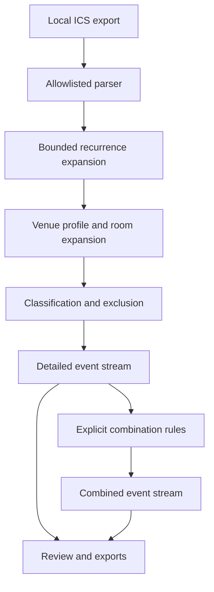

# VenueView

VenueView is a local-first Python application that turns large `.ics` calendar
exports into venue-specific operational schedules and editable Excel function
sheets. It expands recurring events, preserves multi-room assignments, applies
configurable venue profiles, classifies events, proposes carefully bounded
combinations, and highlights uncertain records for human review.

This repository is the sanitized public portfolio edition of a tool created in
response to a real workplace scheduling problem. The project history names the
New York State Olympic Regional Development Authority (ORDA) and relevant
publicly advertised facilities for context. Every venue definition in the
executable configuration, event, rule, threshold, and expected output is
fictional. Employer data, internal configuration, real schedules, generated
operational files, and private Git history are intentionally excluded.

> VenueView is an independently maintained portfolio project. This repository
> is not an official product of, endorsed by, or supported by any current or
> former employer.

## Why it exists

Preparing weekly function sheets from a large shared calendar required staff to
find relevant events, reconcile recurring and multi-location entries, group
related blocks, and manually transfer the result into spreadsheets. That work
was repetitive, difficult to audit, and vulnerable to transcription errors.

VenueView converts that workflow into a reviewable pipeline:

1. Import a local calendar export.
2. Expand recurrences inside a bounded date window.
3. Select only the locations covered by a venue profile.
4. Apply explicit JSON classification, exclusion, and combination rules.
5. Review ambiguous records and proposed combinations.
6. Download detailed or combined CSV and Excel function sheets.

VenueView originated while its creator worked for ORDA at the Lake Placid
Conference Center. He first used it to prepare Excel function sheets for his
own operational workflow; the overarching department and coworkers subsequently continued
using it within the department. VenueView installers were submitted to ORDA IT
and whitelisted for use on the internal network. Creator also delivered an
approximately 45-minute presentation and user walkthrough to roughly 20 staff
members covering the problem, purpose, workflow, and operation of the
application. The presentation generated interest from operations leadership
responsible for the Olympic Center. These facts describe the private project's
history; they do not mean that this public repository is an official or
ORDA-supported release.

## What this public edition demonstrates

- A modular RFC 5545 processing pipeline for `RRULE`, `RDATE`, `EXDATE`,
  cancellations, and detached recurrence exceptions
- Profile-driven venue and room filtering with multi-location expansion
- JSON rule packs for event classification, exclusion, and controlled merging
- Human-readable combination review with keep/separate decisions
- Privacy-conscious aggregate auditing
- Formula-injection-safe CSV and Excel generation
- A weekly function-sheet workbook with editable setup and equipment fields
- A local-only browser interface with in-memory upload processing
- Loopback request checks, CSRF protection, security headers, upload limits,
  and expiring in-memory sessions
- Windows and macOS packaging definitions and release integrity manifests
- Synthetic regression fixtures and automated tests

## Architecture



The interface and exporters call the same processing engine; calendar logic is
not duplicated in the UI.

## Quick start

Python 3.10 or newer is required.

```bash
python -m venv .venv
python -m pip install -e ".[dev]"
python -m pytest
```

Run an aggregate audit of the fictional sample calendar:

```bash
venueview audit data/synthetic/sample_calendar.ics \
  --window-start 2026-07-17 \
  --window-end 2026-07-20 \
  --profile config/profiles/north_arena_rinks.json \
  --rules config/rules/public_rules.json
```

Generate operational rows from the same synthetic input:

```bash
venueview process data/synthetic/sample_calendar.ics \
  --window-start 2026-07-17 \
  --window-end 2026-07-20 \
  --profile config/profiles/north_arena_rinks.json \
  --rules config/rules/public_rules.json \
  --mode combined \
  --allow-sensitive-output
```

Run the local interface:

```bash
venueview-ui --config-dir config
```

It opens a browser page on the local computer. The source calendar is processed
in memory and is not uploaded to a hosted service.

## Fictional demonstration configuration

The repository ships six imaginary profiles including an events center, arena,
training complex, and aerial park. The included rules demonstrate classification based on title beginnings and standardized title variations, category exclusions, location constraints. The demonstration rules include maximum allowed time gaps, safeguards that prevent merging across conflicting bookings, and a conservative fallback for matching events at the same location.

These examples prove the configuration model without revealing how any real
organization names locations or makes scheduling decisions. See
[`docs/COMBINATION_RULES.md`](docs/COMBINATION_RULES.md).

## Privacy boundary

The parser allow lists only the fields needed for scheduling and grouping:


UID, SUMMARY, DTSTART, DTEND, DURATION, RRULE, RDATE, EXDATE,
RECURRENCE-ID, CATEGORIES, LOCATION, STATUS


It does not ingest descriptions, contacts, URLs, attachments, organizers, or
attendees. Because event titles can contain private operational information, privacy audits report only summary counts and never expose event titles or source UIDs. Before VenueView displays or exports event-level data, the user must confirm that they are authorized to process it. Source UIDs are not included in exported files.

Private rules can be loaded from a per-user file outside the repository. The
public build excludes private configuration by default. See
[`docs/PRIVACY.md`](docs/PRIVACY.md) and [`docs/SECURITY.md`](docs/SECURITY.md).

## Important limitations

VenueView is an assisted preparation tool, not a source-of-truth scheduling
system. It does not edit or synchronize calendars, resolve resource conflicts,
infer setup requirements from descriptions, provide remote collaboration,
authenticate multiple users, or guarantee that organization-specific rules are
correct. A user must review outputs before operational use.

VenueView includes the configuration and scripts needed to build desktop installers. A newly built installer should not be considered production-ready or organization-approved until it has been signed, notarized where applicable, reviewed by the receiving organization’s IT and endpoint-security systems, and successfully tested on a clean computer. ORDA’s internal approval applied to the specific installers submitted for review and does not automatically extend to public or future builds. See docs/LIMITATIONS.md.

## Repository map

```text
src/venueview/              Processing engine, exporters, CLI, and local UI
config/profiles/            Fictional venue-selection profiles
config/rules/               Fictional public rules and private-overlay schema
config/venue_taxonomy.json  Fictional venue and room taxonomy
data/synthetic/             Fabricated calendar and expected results
tests/                      Parser, pipeline, exporter, security, and safety tests
packaging/                  Desktop bundle and installer definitions
docs/                       Design, privacy, validation, and portfolio context
```

## Project status

This repository contains VenueView `1.0.0-rc.3`, the sanitized public portfolio
edition. It uses fictional venue profiles, rules, calendar events, and expected
outputs while preserving the application’s representative architecture and
workflow.

This release candidate is intended for demonstration, technical evaluation,
and portfolio review. It is separate from organization-specific deployments
and should not be interpreted as an official ORDA release or a pre-approved
production installer.
See [`docs/VALIDATION.md`](docs/VALIDATION.md) for reproducible checks and
[`docs/PUBLICATION_CHECKLIST.md`](docs/PUBLICATION_CHECKLIST.md) before changing
repository visibility.

## ## License

Copyright © 2026 Rowen Norfolk. All rights reserved.

VenueView is source-available for employment, internship, academic, portfolio, and technical evaluation. Reviewers may inspect and run an unmodified copy for those purposes. Modification, redistribution, production deployment, commercial use, sublicensing, and derivative works are not permitted without prior written permission.

See [LICENSE](LICENSE) for the complete terms. This public portfolio repository is independently maintained and is not an official ORDA product.

