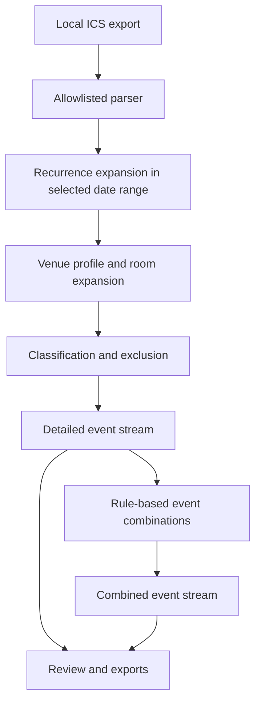

# VenueView

VenueView is a local Python application that turns large `.ics` calendar exports into venue-specific CSV and Excel schedules for a chosen date range. It handles recurring and multi-day events, filters them with configurable venue profiles, classifies them, and suggests groups of related events. If it is not confident about a result, it sends that record to the review screen instead of deciding on its own.

This public version comes from a tool I built to solve a scheduling problem during my internship at the New York State Olympic Regional Development Authority (ORDA). I have named ORDA and publicly listed facilities to explain where the project came from, but the profiles, events, rules, thresholds, and expected outputs in this repository were created for demonstration. Employer data, internal configurations, real schedules, generated operational files, and private Git history are not included.

> I maintain this public repository independently. It is not an official ORDA product.

## Purpose

To prepare weekly function sheets, staff had to filter a live calendar by date and venue, sort out recurring and multi-location events, group related blocks, and copy the results into Excel. It took a lot of repetitive work and created opportunities for transcription errors.

VenueView handles most of that process while leaving uncertain decisions to a person:

1. Import a local calendar export.
2. Expand recurring events within the selected date range.
3. Select only the locations covered by a venue profile.
4. Apply JSON rules for classification, exclusion, and event combinations.
5. Review ambiguous records and proposed combinations.
6. Export a detailed or combined function sheet as a CSV or Excel file.

## Architecture



The interface and exporters use the same processing engine, so I did not duplicate calendar logic in the UI.

## Project history

I created VenueView in July 2026 after seeing how much time this scheduling workflow took during my internship. The first version was a command-line tool I used to generate function sheets and automate much of the event-classification process. It could not yet combine related events, had no interface, and required Python knowledge to operate.

Before my internship ended in August, I expanded the prototype into a standalone application that someone without Python experience could use. I added the interface, the combination and review workflow, packaging, and the other features needed to hand it off.

I gave an hour-long walkthrough to about 20 ORDA staff members, including members of the IT team. I explained how the tool worked, when to use it, and which parts of the old workflow it replaced. The presentation also generated interest from operations leadership responsible for the Olympic Center. Specific VenueView installers were then submitted to ORDA IT for internal review and whitelisted for use on the internal network. That review covered only those installers, not this public repository or later builds.

## What I built

- RFC 5545 processing for `RRULE`, `RDATE`, `EXDATE`, cancellations, and detached recurrence exceptions
- Venue and room filtering driven by configurable profiles, including multi-location expansion
- JSON rule packs for classification, exclusions, and event combinations
- A review screen for keeping or separating suggested event combinations
- An aggregate audit mode that reports counts without exposing event titles or source UIDs
- Protection against formula injection in CSV and Excel exports
- A weekly function-sheet workbook with editable setup and equipment fields
- A local browser interface that processes uploads in memory
- Loopback request checks, CSRF protection, security headers, upload limits, and expiring in-memory sessions
- Windows and macOS packaging definitions with release-integrity manifests
- Synthetic regression fixtures and automated tests

## Quick start

Python 3.10 or newer is required.

```bash
python -m venv .venv
python -m pip install -e ".[dev]"
python -m pytest
```

Run an aggregate audit of the sample calendar:

```bash
venueview audit data/synthetic/sample_calendar.ics \
  --window-start 2026-07-17 \
  --window-end 2026-07-20 \
  --profile config/profiles/north_arena_rinks.json \
  --rules config/rules/public_rules.json
```

Generate operational rows from the same synthetic input:

```bash
venueview process data/synthetic/sample_calendar.ics \
  --window-start 2026-07-17 \
  --window-end 2026-07-20 \
  --profile config/profiles/north_arena_rinks.json \
  --rules config/rules/public_rules.json \
  --mode combined \
  --allow-sensitive-output
```

Run the local interface:

```bash
venueview-ui --config-dir config
```

It opens a browser page on the local computer. The source calendar is processed in memory and is not uploaded to a hosted service.

## Demonstration configuration

This repository comes with six fictional venue profiles. They represent an events center, an arena, a training complex, an aerial park, and other demonstration settings. The examples cover venue hierarchies, room selection, event-title classification, category exclusions, time-gap rules, safeguards against combining conflicting events, and a fallback rule for matching events at the same location.

None of the profiles, rules, thresholds, events, or expected outputs came from ORDA. They were created for this public repository and are not meant to reproduce ORDA's internal scheduling setup. See [`docs/COMBINATION_RULES.md`](docs/COMBINATION_RULES.md).

## Privacy boundary

VenueView reads only the calendar fields it needs for scheduling and grouping:

```text
UID, SUMMARY, DTSTART, DTEND, DURATION, RRULE, RDATE, EXDATE,
RECURRENCE-ID, CATEGORIES, LOCATION, STATUS
```

The parser ignores event descriptions, contacts, URLs, attachments, organizers, and attendees. Event titles can still contain private operational information, so the audit command reports only summary counts and does not expose titles or source UIDs. Before VenueView displays or exports event-level data, users must confirm that they are authorized to process the calendar information. Source UIDs are not included in exported files.

## Important limitations

VenueView prepares and organizes event data. It does not manage calendars or resources.

It does not:

- edit or synchronize calendars
- resolve resource conflicts
- infer setup requirements from event descriptions
- provide remote collaboration
- authenticate multiple users
- guarantee that organization-specific rules are correct

The repository also includes the files used to build desktop installers. Those files package the application; they do not make every build an approved or supported release. See [`docs/LIMITATIONS.md`](docs/LIMITATIONS.md).

## Repository map

```text
src/venueview/              Processing engine, exporters, CLI, and local UI
config/profiles/            Fictional venue-selection profiles
config/rules/               Fictional public rules and private-overlay schema
config/venue_taxonomy.json  Fictional venue and room taxonomy
data/synthetic/             Fabricated calendar and expected results
tests/                      Parser, pipeline, exporter, security, and safety tests
packaging/                  Desktop bundle and installer definitions
docs/                       Design, privacy, validation, and portfolio context
```

## Project status

**Current version:** VenueView `1.0.0-rc.3`.

This release candidate uses fictional venue profiles and rules, along with synthetic calendar events and expected outputs, so the public repository can show how the application works without including employer data. It is meant for demonstration and technical evaluation and is separate from organization-specific builds.

See [`docs/VALIDATION.md`](docs/VALIDATION.md) for reproducible checks and [`docs/PUBLICATION_CHECKLIST.md`](docs/PUBLICATION_CHECKLIST.md) before changing repository visibility.

## License

Copyright © 2026 Rowen Norfolk. All rights reserved.

VenueView is source-available for employment, internship, academic, portfolio, and technical evaluation. Reviewers may inspect and run an unmodified copy for those purposes. Modification, redistribution, production deployment, commercial use, sublicensing, and derivative works are not permitted without prior written permission.

See [LICENSE](LICENSE) for the complete terms.
